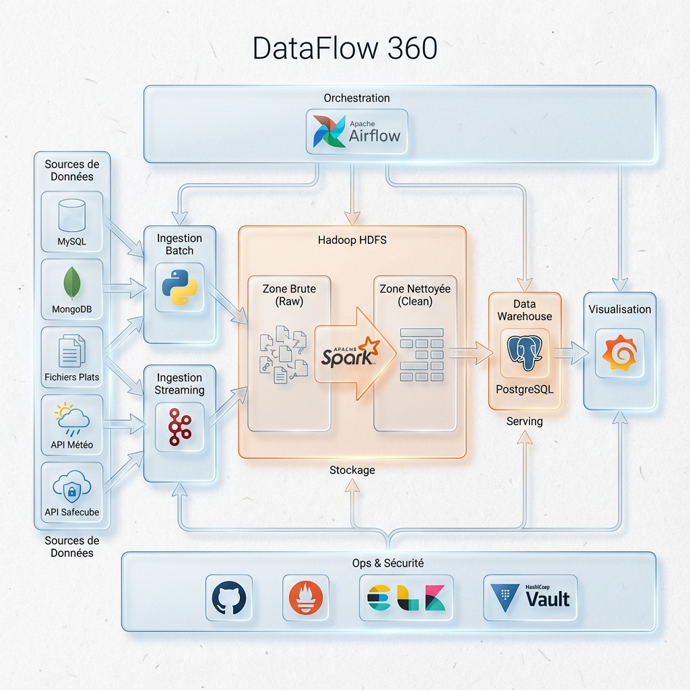

# DataFlowEngineering360 - Pipeline Big Data Maritime



## Présentation

**DataFlowEngineering360** est une plateforme complète de traitement de données conçue pour gérer à la fois des flux **batch** et **temps réel** dans le contexte maritime portuaire. Le projet simule un environnement professionnel de bout en bout, intégrant la génération, l’ingestion, le stockage, le traitement, le monitoring et l’exploitation des données du Port Autonome de Dakar.

Ce projet a été réalisé par **Alla NIANG**, apprenant en Développement DATA à **ODC (Orange Digital Center), Promo 7**.

## État d'avancement

🚧 **Projet en cours de développement : 85%**

Le pipeline end-to-end est fonctionnel. Les travaux restants concernent principalement l'optimisation des transformations, l'enrichissement des dashboards et la mise en place complète du pipeline CI/CD.

## Objectifs du projet

- **Pipeline Hybride** : Créer un pipeline de données capable de traiter des flux batch (historiques) et streaming (temps réel).
- **Architecture Moderne** : Mettre en œuvre les bonnes pratiques du Data Engineering (Data Lake, Data Warehouse, ELT/ETL).
- **Infrastructure** : Conteneuriser l’architecture complète via Docker pour une portabilité maximale.
- **Analytique** : Fournir des outils de BI et de Data Science pour l'aide à la décision.

## Fonctionnalités clés

- **Génération de données** : Simulation de trafic maritime, données météorologiques et logistiques (Python, Faker).
- **Ingestion multiformat** : Support de fichiers CSV, JSON, Excel, XML, YAML et flux API.
- **Stockage hétérogène** :
    - **Data Lake** : HDFS (via Hadoop) pour le stockage brut.
    - **NoSQL** : MongoDB (documents), Cassandra (séries temporelles), Neo4j (graphes).
    - **Data Warehouse** : PostgreSQL pour les données structurées et modélisées (schéma en étoile).
- **Orchestration** : Apache Airflow pour la gestion des workflows batch.
- **Streaming** : Apache Kafka pour le traitement des événements en temps réel.
- **Monitoring** : Stack ELK (Elasticsearch, Logstash, Kibana) et Grafana pour la supervision de l'infrastructure et des flux.
- **Valorisation** : Dashboards interactifs pour le suivi des KPIs portuaires.

## Contrôle Qualité des Données

🚧 **En cours d'implémentation**

Le projet intègre **Great Expectations** pour garantir la fiabilité et la qualité des données à chaque étape du pipeline. Des validations sont effectuées pour vérifier :
- La conformité des schémas.
- La validité des valeurs (nulls, types, plages).
- La cohérence temporelle des données.

## Architecture


L'architecture est conçue pour être **modulaire et évolutive**. Elle permet d'ajouter facilement de nouvelles sources de données ou de nouveaux modules de traitement sans impacter l'existant.

Le pipeline est structuré autour de plusieurs composants :

```
DataFlow_Engineering360/
├── src/                  # Code source du projet
│   ├── collection/       # Scripts de collecte
│   ├── ingestion/        # Pipelines Spark et Kafka
│   ├── transformation/   # Transformations de données
│   ├── orchestration/    # DAGs Airflow
│   ├── monitoring/       # Configuration ELK
│   └── utils/            # Fonctions utilitaires
├── docker-compose*.yml   # Fichiers d'orchestration Docker
├── scripts/              # Scripts de démarrage/arrêt
└── ...
```

### Technologies utilisées

| Domaine             | Outils                         |
|---------------------|-------------------------------|
| **Langages**        | Python, SQL, Shell            |
| **Génération**      | Faker, Pandas, Requests       |
| **Ingestion**       | Apache Kafka, Spark Streaming |
| **Traitement**      | Apache Spark (PySpark)        |
| **Orchestration**   | Apache Airflow                |
| **Stockage**        | PostgreSQL, MongoDB, HDFS     |
| **Monitoring**      | Elasticsearch, Logstash, Kibana, Grafana |
| **Infrastructure**  | Docker, Docker Compose        |

## Installation et Démarrage

### Prérequis

- Docker et Docker Compose installés.
- Une machine avec suffisamment de RAM (recommandé : 16GB+) car la stack complète est conséquente.

### Installation

1.  Cloner le dépôt :
    ```bash
    git clone https://github.com/niangalla/DataFlowEngineering360_BigData_Maritime_Pipeline.git
    cd DataFlowEngineering360_BigData_Maritime_Pipeline
    ```

2.  Configurer l'environnement :
    - Copier le fichier `.env.example` (si présent) vers `.env` et ajuster les variables si nécessaire.

### Lancement

Le projet utilise des scripts pour faciliter le démarrage des nombreux services :

```bash
# Démarrer tous les services
./start-all.sh

# Arrêter tous les services
./stop-all.sh
```

Vous pouvez également lancer des modules spécifiques via Docker Compose :

```bash
docker-compose -f docker-compose.core.yml up -d
docker-compose -f docker-compose.airflow.yml up -d
# ... autres fichiers compose
```

## Auteur

**Alla NIANG**
- **Email** : niangalla98@gmail.com
- **Formation** : Développement Data, Orange Digital Center (Promo 7)

---
*Ce projet est réalisé dans un but pédagogique et de démonstration de compétences en Data Engineering.*
